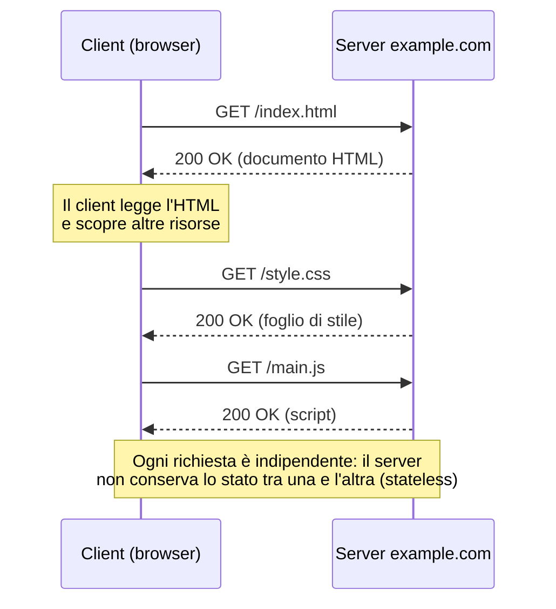
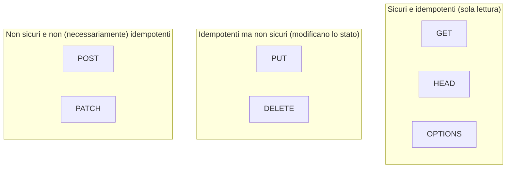
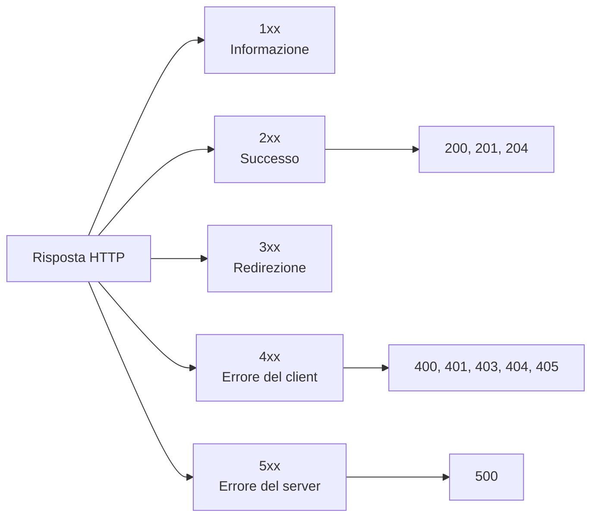
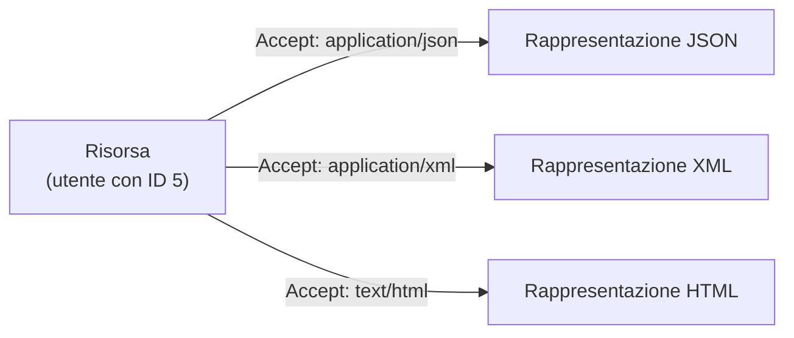

# Fondamenti di REST e del protocollo HTTP

## Prerequisiti
- Conoscere la differenza tra client e server.
- Sapere cosa è un indirizzo web (URL).
- Avere nozioni di base su Internet e sul concetto di rete.

## Obiettivi
- Capire come funziona il protocollo HTTP nello scambio richiesta/risposta.
- Riconoscere i metodi HTTP e il loro significato semantico.
- Distinguere i metodi sicuri (safe) da quelli idempotenti.
- Comprendere i cinque principi dello stile architetturale REST.
- Saper leggere i principali codici di stato HTTP.
- Progettare URI di risorse seguendo le convenzioni REST.

## 1. Il protocollo HTTP
HTTP significa *Hypertext Transfer Protocol*.
È un protocollo a livello applicativo nato per trasmettere documenti, come le pagine HTML.
HTTP funziona secondo lo schema **client-server**.
Il client apre una connessione verso il server, invia una **richiesta** (request) e attende una **risposta** (response).

HTTP ha quattro caratteristiche fondamentali:

- **Client-Server**: il client chiede, il server risponde.
- **Stateless** (senza stato): ogni richiesta è indipendente dalle altre.
- **Basato su TCP**: usa una connessione di trasporto affidabile.
- **Rendibile sicuro**: nella variante cifrata diventa HTTPS.

Il termine *stateless* indica che il server non mantiene alcun collegamento tra due richieste successive.
Anche se due richieste viaggiano sulla stessa connessione, il server le tratta come scollegate.
Solo il client sa che sono correlate.

Il diagramma seguente mostra il caricamento di una pagina: ogni richiesta è indipendente dalle altre.



## 2. HTTPS: la versione sicura di HTTP
HTTPS è HTTP che viaggia dentro un canale cifrato.
Usa il protocollo **SSL/TLS** (*Transport Layer Security*) per cifrare i dati scambiati.
Questo protegge le informazioni da intercettazioni e manomissioni.
Il lucchetto nella barra degli indirizzi del browser indica che il sito usa un certificato TLS valido.

## 3. Anatomia di una richiesta HTTP
Una richiesta HTTP è composta da quattro parti:

- **Method** (metodo): l'azione che vogliamo compiere.
- **URL**: l'indirizzo a cui inviamo la richiesta.
- **Version**: la versione del protocollo (1.1, 2, 3).
- **Headers**: coppie chiave-valore che descrivono la richiesta.
- **Body** (opzionale): il contenuto della richiesta, detto anche *payload*.

Il termine **payload** indica il corpo del messaggio, cioè i dati trasportati.

Gli header più comuni nelle richieste sono:

- `Accept`: indica i formati che il client è in grado di elaborare.
- `Content-Type`: indica il formato del corpo inviato.
- `Authorization`: contiene le credenziali per autenticarsi.
- `User-Agent`: descrive il client che invia la richiesta.

## 4. Anatomia di una risposta HTTP
Una risposta HTTP è composta da quattro parti:

- **Version**: la versione del protocollo.
- **Status Code**: il codice di stato che riassume l'esito.
- **Headers**: coppie chiave-valore che descrivono la risposta.
- **Body** (opzionale): il contenuto restituito.

L'header `Content-Length` indica la dimensione del corpo in byte.
È tipicamente presente nelle risposte.

## 5. I metodi HTTP e il loro significato
Ogni metodo HTTP ha un significato semantico preciso.
Usare il metodo corretto è la base di un'API ben progettata.

- **GET**: ottiene una risorsa. Invia i parametri nell'URL, senza corpo.
- **HEAD**: ottiene solo gli header di una risorsa, senza il corpo.
- **POST**: crea una nuova risorsa.
- **PUT**: sostituisce interamente una risorsa esistente.
- **PATCH**: aggiorna parzialmente una risorsa esistente.
- **DELETE**: cancella una risorsa esistente.
- **OPTIONS**: chiede quali metodi e header sono supportati per una risorsa.
- **TRACE**: restituisce al client la richiesta così come è arrivata (eco di rete).
- **CONNECT**: crea un tunnel TCP trasparente, usato con i server proxy.

### GET serve solo a leggere
GET recupera dati e non deve mai modificare lo stato del server.
I suoi parametri viaggiano nella *query string* dell'URL.
Poiché i parametri sono nell'URL, una richiesta GET può essere salvata nei segnalibri e condivisa.
Per questo, una ricerca con molti filtri che deve restare salvabile come segnalibro si realizza con GET.

### POST crea quando l'ID lo genera il server
POST si usa su una collezione per creare una nuova sotto-risorsa.
L'identificatore della nuova risorsa è deciso dal server.
Per creare un nuovo utente il cui ID è generato dal database, si invia `POST /users`.
Il client non conosce ancora l'ID, quindi non può puntare a un URI specifico.

POST funge anche da "verbo jolly" per azioni che non rientrano nello schema CRUD.
*CRUD* significa Create, Read, Update, Delete: le quattro operazioni base sui dati.
Un'azione come l'approvazione di un preventivo si modella come sotto-risorsa virtuale.
Esempio: `POST /quotes/12/approval`.

### PUT sostituisce, PATCH aggiorna in parte
PUT effettua una **sostituzione completa** della risorsa all'URI indicato.
Bisogna inviare l'intero oggetto aggiornato.
Se PUT viene inviato all'URI di una collezione, ne richiede la sostituzione totale.
Esempio: `PUT /products` sovrascrive l'intero elenco dei prodotti.

PATCH applica una **modifica parziale**: aggiorna solo i campi inviati.
Per aggiornare solo la password di un utente, lasciando intatti gli altri campi, si usa PATCH.
Usare PUT in questo caso azzererebbe i campi non inviati.

Se un client invia PUT verso un URI che non esiste ancora, e l'URI è controllato dal client, il server può creare la risorsa da zero.
In quel caso risponde tipicamente con `201 Created`.

### HEAD risparmia banda
HEAD restituisce gli stessi header di GET ma omette il corpo.
Serve a controllare i metadati di una risorsa senza scaricarla.
È utile per verificare se un file di grandi dimensioni è cambiato, risparmiando banda.

### OPTIONS scopre le capacità ed è la base del pre-flight CORS
OPTIONS permette al client di scoprire quali metodi e header sono ammessi per un URI.
È usato dal browser come richiesta **pre-flight** nei flussi CORS.
*CORS* (Cross-Origin Resource Sharing) regola le richieste tra domini diversi.
Prima di una richiesta complessa verso un altro dominio, il browser invia automaticamente una OPTIONS.
Il browser controlla l'header `Access-Control-Allow-Methods` prima di autorizzare la richiesta reale.

### TRACE e CONNECT
TRACE avvia un test di *loopback*: il server rispedisce al client il messaggio ricevuto.
Serve a vedere se i proxy intermedi hanno alterato la richiesta.
È spesso disabilitato in produzione per il rischio di attacchi Cross-Site Tracking (XST).

CONNECT stabilisce un tunnel di rete verso un server di destinazione.
Si usa per instradare comunicazioni HTTPS cifrate attraverso un proxy.

### Il set dei metodi è estensibile
L'insieme dei metodi HTTP non è fisso.
HTTP è un protocollo estensibile.
PATCH è stato aggiunto con l'RFC 5789.
Il protocollo WebDAV ha introdotto verbi come `PROPFIND`, `MKCOL` e `LOCK`.

## 6. Metodi sicuri e metodi idempotenti
Due proprietà descrivono il comportamento dei metodi: la sicurezza e l'idempotenza.

Un metodo è **sicuro** (safe) se è di sola lettura e non causa effetti distruttivi sullo stato del server.
GET, HEAD e OPTIONS sono metodi sicuri.

Un metodo è **idempotente** se inviarlo una o cento volte produce lo stesso stato finale sul server.

Sicurezza e idempotenza non sono la stessa cosa.

- GET è sicuro e idempotente.
- PUT e DELETE sono idempotenti ma non sicuri, perché modificano lo stato.
- POST non è né sicuro né idempotente.

L'unico metodo sia sicuro sia idempotente, tra quelli di uso comune, è **GET**.

La mappa seguente raggruppa i metodi in base a queste due proprietà.



### Perché GET non deve modificare lo stato
GET è un metodo sicuro.
Browser, proxy e crawler sono quindi autorizzati a riutilizzare la cache o a pre-scaricare i link.
Se un link GET compisse un'azione distruttiva, un crawler che lo indicizza cancellerebbe i dati.
Per questo è vietato usare GET per cancellare elementi o eseguire transazioni.
Un endpoint GET che incrementa un contatore a ogni chiamata viola formalmente il principio di sicurezza.

### Perché PUT e DELETE sono idempotenti
PUT rimpiazza interamente l'oggetto a quell'URI.
Sovrascrivere lo stesso valore più volte non cambia il risultato finale.

DELETE è idempotente perché, dopo la prima chiamata, la risorsa è rimossa.
Le chiamate successive non alterano più lo stato del server.
Le risposte possono cambiare (200 alla prima, 404 alle successive), ma lo stato dei dati resta invariato.
L'idempotenza riguarda lo stato del server, non il codice di risposta.

### Perché POST non è idempotente
POST non garantisce l'idempotenza.
Inviare più volte la stessa POST crea di solito più risorse distinte, ciascuna con un identificatore diverso.
Per esempio, ripetere una POST può duplicare un ordine.

### PATCH non è sempre idempotente
PATCH non è garantito idempotente in tutte le implementazioni.
Può esserlo, ma dipende dall'operazione.
Un PATCH che dice "aggiungi 5 al contatore" muta lo stato a ogni esecuzione ripetuta.

### Idempotenza e gestione degli errori di rete
L'idempotenza rende sicuro il *retry* automatico.
Se la connessione cade prima della risposta, il client può reinviare la richiesta senza rischi solo con metodi idempotenti.
PUT è idempotente, quindi il reinvio porta allo stesso stato finale.
POST e un PATCH incrementale non offrono questa garanzia.

## 7. I codici di stato HTTP
Ogni risposta HTTP contiene un codice di stato numerico.
I codici si dividono in cinque gruppi.

- **1xx (Information)**: la richiesta è ancora in corso.
- **2xx (Success)**: operazione completata con successo.
- **3xx (Redirection)**: la risorsa è altrove, serve una redirezione.
- **4xx (Client Error)**: errore causato dal client.
- **5xx (Server Error)**: errore causato dal server.



I codici più importanti da conoscere sono:

- `200 OK`: richiesta completata, ecco il risultato.
- `201 Created`: nuova risorsa creata con successo.
- `204 No Content`: completata, ma senza contenuto da restituire.
- `400 Bad Request`: la richiesta è malformata o mancano parametri.
- `401 Unauthorized`: il client non è autenticato.
- `403 Forbidden`: il client è autenticato ma non ha i permessi.
- `404 Not Found`: la risorsa non esiste.
- `405 Method Not Allowed`: l'endpoint esiste ma il metodo non è ammesso.
- `500 Internal Server Error`: errore interno e sconosciuto del server.

### Casi pratici sui codici di stato
Se un client invia un PUT con un payload dalla sintassi malformata, che il server non riesce a interpretare, la risposta corretta è `400 Bad Request`.

`403 Forbidden` non significa che la risorsa non esiste.
Significa che la risorsa esiste ma il client non ha i permessi per accedervi.
Una risorsa inesistente restituisce invece `404 Not Found`.

`405 Method Not Allowed` indica che l'endpoint esiste, ma quel metodo non è consentito per quella risorsa.
In questo caso il server dovrebbe includere l'header `Allow` per elencare i metodi supportati.
Esempio: `Allow: GET, POST`.

Quando una POST crea con successo una risorsa, la buona pratica REST prevede `201 Created`.
La risposta dovrebbe includere l'header `Location` con l'URL della nuova risorsa.

## 8. Lo stile architetturale REST
REST significa *REpresentational State Transfer*.
È uno **stile architetturale**, non un protocollo.
I suoi vincoli sono definiti in modo astratto.
Sono indipendenti dal protocollo di trasporto e si applicano a qualsiasi sistema request-reply.
La sua implementazione più diffusa è REST su HTTP.
REST nasce per sostituire stili più rigidi come SOAP, RMI e RPC.

I cinque principi chiave di REST sono:

1. Dare a ogni risorsa un **ID univoco** (un URI).
2. Usare sempre **metodi standard** per interagire con una risorsa.
3. Astrarre la risorsa dalla sua **rappresentazione**, ammettendone più di una.
4. Far avvenire la comunicazione in modo **stateless**.
5. Far contenere a ogni risorsa i **collegamenti** alle risorse correlate.

### Risorsa e rappresentazione sono cose diverse
Una **risorsa** è l'obiettivo concettuale astratto, per esempio "l'utente con ID 5".
Una **rappresentazione** è il modo in cui il server manifesta quella risorsa in un dato momento.
La stessa risorsa può essere rappresentata come JSON, HTML o XML.
Risorsa e rappresentazione non coincidono.
La scelta del formato avviene tramite *content negotiation*, di solito con l'header `Accept`.



### Le risorse e i loro URI
Una risorsa è un qualunque elemento della business logic con cui dobbiamo interagire.
Le risorse possono essere singoli elementi con ID univoco oppure collezioni di elementi.

Un URI REST è composto da:

- **scheme**: il protocollo, per esempio `https`.
- **host**: dove ci colleghiamo, per esempio `example.org`.
- **path parameters**: per disambiguare risorse di tipo diverso.
- **query parameters**: per filtrare risorse dello stesso tipo.

Esempi di URI ben progettati:

- Collezione di utenti: `https://example.org/users`
- Utente specifico: `https://example.org/users/{username}`
- Sotto-collezione con filtro: `https://example.org/users/{username}/tickets?status=closed`

### Il vincolo Stateless
Il vincolo stateless impone che ogni richiesta contenga tutto il contesto necessario al server.
Il server non conserva memoria delle richieste passate.
Non esiste uno stato della comunicazione lato server.
Esistono solo lo stato della risorsa e lo stato del client.
Questo vincolo migliora scalabilità, visibilità e affidabilità.
Il server non può riutilizzare un contesto di sicurezza salvato da una richiesta precedente.

### Il vincolo di Interfaccia Uniforme
L'**interfaccia uniforme** è uno dei pilastri di REST.
Si articola in quattro sotto-vincoli:

1. Identificazione delle risorse, per esempio tramite URI.
2. Manipolazione delle risorse tramite le loro rappresentazioni.
3. Messaggi auto-descrittivi.
4. HATEOAS, cioè l'uso di collegamenti ipertestuali nelle risposte.

L'uso di token crittografici come i JWT non fa parte dell'interfaccia uniforme.
La sicurezza dei pacchetti è un tema separato dai pilastri teorici di REST.

### Il vincolo di Cache
Il vincolo *Cache* stabilisce che le risposte devono essere etichettate come cacheabili o non cacheabili.
L'etichettatura può essere esplicita o implicita.
Client e proxy intermedi possono così riutilizzare una risposta per richieste equivalenti.
La cache riduce le latenze e alleggerisce il carico sul server.

Nel comportamento di default:

- Le richieste GET vengono messe in cache.
- Le richieste POST non vengono messe in cache.
- Le richieste PUT, PATCH e DELETE non vengono mai messe in cache.

Solo i metodi sicuri e idempotenti, principalmente GET e HEAD, sono idonei alla cache di default.

## 9. Esempio guidato
Vediamo la creazione di un utente con ID generato dal server.

### Request
```http
POST /users HTTP/1.1
Host: api.example.com
Content-Type: application/json

{"name":"Mara Rossi","email":"mara@example.com"}
```

### Response
```http
HTTP/1.1 201 Created
Location: /users/123
Content-Type: application/json

{"id":123,"name":"Mara Rossi","email":"mara@example.com"}
```

Il server genera l'ID `123` e lo comunica con l'header `Location`.
Per aggiornare in seguito solo la email, si usa PATCH.

### Request
```http
PATCH /users/123 HTTP/1.1
Host: api.example.com
Content-Type: application/json

{"email":"mara.rossi@example.com"}
```

### Response
```http
HTTP/1.1 200 OK
Content-Type: application/json

{"id":123,"name":"Mara Rossi","email":"mara.rossi@example.com"}
```

## 10. Errori comuni
- Errore: usare GET per cancellare o modificare dati (per esempio `GET /orders/1234?action=delete`).
  Correzione: GET deve essere di sola lettura; usare DELETE o POST su una sotto-risorsa.
- Errore: inserire verbi nell'URI, come `POST /users/new`.
  Correzione: l'URI deve indicare risorse, non azioni; usare `POST /users`.
- Errore: usare PUT per cambiare un solo campo, azzerando gli altri.
  Correzione: usare PATCH per gli aggiornamenti parziali.
- Errore: rispondere sempre `200 OK` e usare `500` per ogni errore.
  Correzione: scegliere il codice corretto, per esempio 400, 401, 403, 404 o 405.
- Errore: confondere `403 Forbidden` con `404 Not Found`.
  Correzione: 403 indica mancanza di permessi, 404 indica risorsa inesistente.
- Errore: esporre come URI gli ID interni e sequenziali del database.
  Correzione: una risorsa non coincide con una riga di tabella; evitare ID prevedibili.

## Riepilogo
- HTTP è un protocollo client-server, stateless e basato su TCP, reso sicuro da HTTPS.
- Ogni metodo HTTP ha una semantica precisa: GET legge, POST crea, PUT sostituisce, PATCH aggiorna in parte, DELETE cancella.
- GET è sicuro e idempotente; PUT e DELETE sono idempotenti ma non sicuri; POST non è né l'uno né l'altro.
- I codici di stato comunicano l'esito: 2xx successo, 4xx errore del client, 5xx errore del server.
- REST è uno stile architetturale basato su risorse con ID univoco, metodi standard, rappresentazioni multiple, comunicazione stateless e collegamenti tra risorse.
