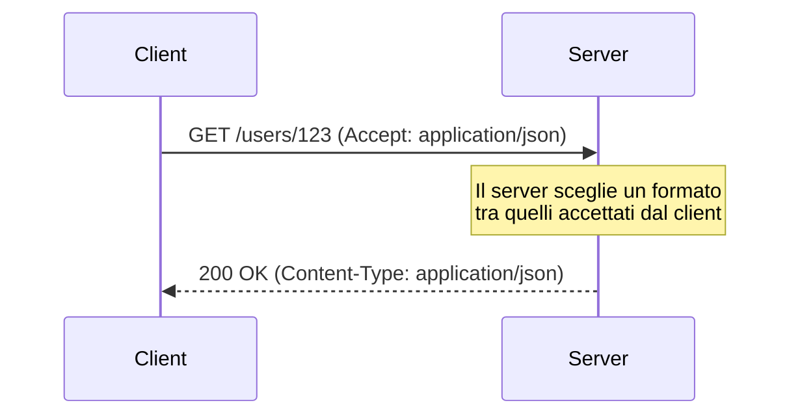
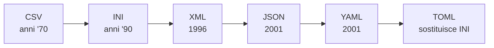

# Richiesta, risposta e formati di interscambio dati

## Prerequisiti
- Conoscere la struttura di richiesta e risposta HTTP.
- Sapere cosa sono gli header `Content-Type` e `Accept`.
- Avere familiarità con il concetto di coppia chiave-valore.

## Obiettivi
- Capire cosa è un formato di interscambio dati e a cosa serve.
- Conoscere la sintassi di JSON, YAML, TOML, XML e INI.
- Scegliere il formato adatto a seconda del contesto.
- Riconoscere gli errori di sintassi più frequenti in ciascun formato.
- Impostare correttamente il `Content-Type` di una risposta.

## 1. Cosa è un formato di interscambio dati
Con HTTP la comunicazione è strutturata in richieste e risposte.
Client e server devono però accordarsi su come scrivere i dati nel corpo dei messaggi.
Un **formato di interscambio dati** è l'insieme delle regole sintattiche condivise tra client e server.
Queste regole stabiliscono come i dati vanno scritti e interpretati.
Si applicano al corpo (payload) di richieste e risposte HTTP.

Il formato scelto viene dichiarato nell'header `Content-Type`.
Il client indica i formati che accetta con l'header `Accept`.



## 2. Un po' di storia: CSV e INI
Il formato **CSV** (*Comma Separated Values*) nasce nei primi anni '70.
È stato il primo formato di interscambio standard davvero usato.
Un record CSV è una riga di testo con i campi separati da virgole.
CSV soffre di alcuni limiti: non c'è accordo sul separatore e permette un solo livello di dati.
Va bene per import/export su file, ma non per i servizi web.

Il formato **INI** nasce con Windows negli anni '90.
Anche INI è adatto allo scambio di file di configurazione, ma non ai servizi web.

La figura riassume l'evoluzione storica dei formati di interscambio.



## 3. Il formato INI
INI organizza i dati in coppie chiave-valore.
L'assegnazione di una proprietà si scrive con il segno di uguale.
La forma è `proprietà = "valore"`, oppure più semplicemente `proprietà=valore`.

Le parentesi quadre dichiarano e separano le **sezioni** logiche del file.
Per esempio, `[Database]` apre la sezione dedicata al database.

INI ha due limiti principali:

- Non permette l'annidamento oltre il livello della sezione.
- Non supporta il concetto di vettore o array.

Esempio di file INI:

```ini
[Database]
host = "localhost"
porta = 5432
utente = "admin"
```

## 4. Il formato XML
XML nasce nel 1996.
È stato il primo vero standard di interscambio dati per il web.
Permette l'annidamento dei dati e l'uso di grammatiche per la verifica.
Su XML si possono costruire sotto-protocolli, come SOAP.

### Struttura di base
In XML i dati sono racchiusi tra **tag** di apertura e chiusura.
Ogni tag di apertura deve avere un tag di chiusura corrispondente.
Un documento XML deve avere **un solo elemento radice** (root) che racchiude tutti gli altri.
Non può avere più elementi di primo livello separati.

Gli elementi possono avere attributi.
Un elemento vuoto può usare un tag autochiudente che termina con uno slash.
La forma `<elemento />` equivale a `<elemento></elemento>`.

### Case sensitivity
XML è rigorosamente **case-sensitive**.
Un tag aperto come `<Dato>` non può essere chiuso con `</dato>`.
Maiuscole e minuscole devono coincidere perfettamente.

### Commenti
I commenti in XML si scrivono con la sintassi ereditata da HTML.
La forma è `<!-- Questo è un commento -->`.

### Namespace
I **namespace** servono a evitare conflitti tra nomi uguali provenienti da vocabolari diversi.
Si dichiarano con la sintassi `xmlns:prefisso`.
Associano i tag a un URI, così tag con lo stesso nome possono coesistere.

### Sezioni CDATA
Una sezione `<![CDATA[ ... ]]>` istruisce il parser a trattare il testo come puro dato.
I caratteri speciali di markup come `<` o `&` al suo interno vengono ignorati.
È utile per inserire frammenti di codice senza che vengano interpretati come tag.

### Well-formed e valid
Un documento XML è **ben formato** (well-formed) se segue la sintassi base di XML.
È **valido** (valid) se rispetta anche le regole di una grammatica DTD o XML Schema (XSD).
Quindi "ben formato" riguarda la sintassi, "valido" riguarda la conformità a uno schema.

### Il prologo
Il **prologo** è la dichiarazione iniziale, per esempio `<?xml version="1.0" encoding="UTF-8"?>`.
Il prologo è opzionale.
Un file XML può esserne privo e risultare comunque ben formato, se usa codifiche standard come UTF-8.

### Limiti di XML
XML è potente ma ha svantaggi:

- È **complesso**, anche per i dati più semplici.
- È **rigido**, perché le grammatiche lo rendono poco flessibile.
- È **verboso**: lo stesso dato occupa molti più caratteri rispetto ad altri formati.

Esempio di documento XML:

```xml
<?xml version="1.0" encoding="UTF-8"?>
<utente>
  <id>123</id>
  <nome>Mara Rossi</nome>
  <attivo>true</attivo>
</utente>
```

## 5. Il formato JSON
JSON nasce nel 2001.
JSON significa *JavaScript Object Notation* e deriva dalla notazione degli oggetti di JavaScript.
È lo standard di interscambio più usato oggi sul web.
Permette l'annidamento dei dati ed è basato su coppie chiave-valore.

### Oggetti e array
Un **oggetto** è un insieme di coppie chiave-valore racchiuso tra parentesi graffe `{ }`.
Un **array** è un elenco ordinato di valori racchiuso tra parentesi quadre `[ ]`.

### Sintassi delle coppie chiave-valore
In JSON sia le chiavi sia le stringhe devono usare i doppi apici.
La forma corretta è `"stato": "attivo"`.
Scrivere `stato: 'attivo'` o `stato = "attivo"` non è valido.

### Tipi di dato nativi
JSON definisce sei tipi di dato nativi, secondo lo standard RFC 8259:

- String (stringa)
- Number (numero)
- Object (oggetto)
- Array
- Boolean (booleano)
- Null

Tipi come Date, Function o Integer non sono tipi nativi di JSON.

### I booleani
I valori booleani si scrivono in lettere minuscole: `true` e `false`.
Non devono essere racchiusi tra virgolette.
Scrivere `"true"` lo trasforma in una stringa.
Scrivere `TRUE` in maiuscolo genera un errore.

### I numeri
Il tipo Number supporta la notazione scientifica esponenziale, per esempio `2.9e-5`.
Vieta gli zeri iniziali non necessari negli interi, per esempio `05` non è valido.
Non ammette le costanti `NaN` o `Infinity`.
Non riconosce i prefissi esadecimali `0x` o binari `0b`.

### Array eterogenei
Un array JSON può contenere elementi di tipi differenti mescolati tra loro.
Per esempio, stringhe, numeri e oggetti nello stesso array.
Gli array JSON sono quindi eterogenei.

### Cosa JSON non permette
JSON nativo **non supporta i commenti**.
Qualsiasi commento, come `// testo` o `/* testo */`, rende il file non valido.

Le **trailing comma** non sono permesse.
Una virgola dopo l'ultimo elemento, come `{"id": 1,}`, è un errore di sintassi.

Le chiavi duplicate in un oggetto dovrebbero essere univoche.
Lo standard però non impone il fallimento del parsing in caso di duplicati.
Il comportamento dipende dal parser, che di solito tiene l'ultimo valore.

### Codifica e media type
La codifica predefinita e obbligatoria per JSON è **UTF-8**, secondo l'RFC 8259.
Le vecchie specifiche toleravano UTF-16 e UTF-32, ma lo standard attuale impone UTF-8.

Quando un'API risponde in JSON, l'header `Content-Type` corretto è `application/json`.
Valori come `text/json` o `application/javascript` non sono corretti.

Esempio di documento JSON:

```json
{
  "id": 123,
  "nome": "Mara Rossi",
  "attivo": true,
  "ruoli": ["admin", "editor"]
}
```

## 6. Il formato YAML
YAML nasce nel 2001.
L'acronimo originale era *Yet Another Markup Language*.
È stato poi ridefinito come acronimo ricorsivo *YAML Ain't Markup Language*.
La ridefinizione sottolinea che YAML è orientato ai dati, non al markup di documenti.
YAML vince per la sua semplicità e si usa soprattutto per i file di configurazione.

### Indentazione
YAML definisce la gerarchia tramite l'**indentazione con spazi**.
Non usa parentesi né tag di chiusura.
L'uso del carattere di tabulazione (Tab) è severamente vietato.
Un Tab nell'indentazione genera un errore di parsing.

### Liste
Una lista sequenziale si dichiara facendo precedere ogni elemento da un trattino e uno spazio.
La forma è `- elemento`.

### Stringhe multilinea
Per preservare i ritorni a capo in una stringa multilinea si usa il carattere pipe `|`.
Il pipe, posto dopo la chiave, indica un blocco *literal* che mantiene i newline.

### Documenti multipli
YAML può contenere più documenti in un solo file.
Il separatore tra documenti è la sequenza di tre trattini `---`.

### Ancore e alias
Le **ancore** e gli **alias** evitano di ripetere la stessa struttura.
La e commerciale `&` definisce l'ancora.
L'asterisco `*` richiama l'ancora come alias.

### Commenti e tipizzazione
YAML supporta i commenti con il carattere cancelletto `#`.
Tutto ciò che segue `#` viene ignorato dal parser.

YAML tenta di riconoscere automaticamente i tipi.
È possibile forzare un tipo esplicito anteponendo `!!` seguito dal tipo.
Per esempio, `!!str 123` trasforma il numero in una stringa.

### Relazione con JSON
Dalle specifiche YAML 1.2, YAML è un **superset** di JSON.
Questo significa che ogni file JSON valido è anche un file YAML valido.
Un parser YAML 1.2 può elaborare nativamente codice JSON.

Esempio di documento YAML:

```yaml
id: 123
nome: Mara Rossi
attivo: true
ruoli:
  - admin
  - editor
descrizione: |
  Prima riga.
  Seconda riga.
```

## 7. Il formato TOML
TOML significa *Tom's Obvious, Minimal Language*.
Nasce per sostituire il formato INI.
Aggiunge l'annidamento mantenendo una sintassi simile a INI.
È progettato per i file di configurazione ed è ottimizzato per la leggibilità umana.
Mappa in modo diretto e senza ambiguità le tabelle hash.

### Coppie chiave-valore
TOML separa la chiave dal valore con il segno di uguale `=`.
A differenza di JSON e YAML, che usano i due punti, TOML usa rigorosamente `=`.
La forma è `chiave = valore`.

### Tabelle
Una **tabella** è un gruppo di coppie chiave-valore.
Si dichiara con il nome racchiuso tra singole parentesi quadre, per esempio `[database]`.

### Array di tabelle
Un **array di tabelle** raccoglie una lista di oggetti omogenei.
Si dichiara con doppie parentesi quadre, per esempio `[[prodotti]]`.
Ogni ripetizione di `[[prodotti]]` aggiunge un nuovo elemento all'array.

### Stringhe multilinea
Le stringhe multilinea si delimitano con tre virgolette doppie consecutive `"""`.
In alternativa si usano tre virgolette singole consecutive `'''`.
Le tre virgolette doppie gestiscono le stringhe *basic*, con escape supportati.
Le tre virgolette singole gestiscono le stringhe *literal*, senza alcun escape.

### Date e numeri
TOML ha un supporto nativo per date e orari.
Usa il formato standard RFC 3339 / ISO 8601, per esempio `1979-05-27T07:32:00Z`.
Per i numeri grandi, l'underscore separa le cifre senza alterare il valore.
Per esempio, `10_000_000` viene letto come dieci milioni.

### Tabelle in linea, case sensitivity e commenti
Le **tabelle in linea** usano le parentesi graffe, per esempio `{ primo = "Tom", ultimo = "Werner" }`.
In esse le virgole tra le coppie sono obbligatorie, esattamente come in JSON.
Le chiavi e i nomi delle tabelle sono **case-sensitive**: `chiave` e `Chiave` sono distinte.
I commenti si scrivono con il carattere cancelletto `#`.

Esempio di documento TOML:

```toml
# Configurazione del database
[database]
host = "localhost"
porta = 5432
limite = 10_000

[[utente]]
nome = "admin"

[[utente]]
nome = "editor"
```

## 8. Esempio guidato: scelta del formato
Il client chiede una risorsa indicando il formato preferito con l'header `Accept`.
Il server risponde dichiarando il formato usato con `Content-Type`.

### Request
```http
GET /users/123 HTTP/1.1
Host: api.example.com
Accept: application/json
```

### Response
```http
HTTP/1.1 200 OK
Content-Type: application/json

{"id":123,"nome":"Mara Rossi","attivo":true}
```

Se il client avesse richiesto `Accept: application/xml`, il server avrebbe potuto rispondere con la stessa risorsa in formato XML.
Questo meccanismo si chiama *content negotiation*.

## 9. Errori comuni
- Errore: usare gli apici singoli per le stringhe JSON, come `'attivo'`.
  Correzione: in JSON chiavi e stringhe richiedono i doppi apici.
- Errore: lasciare una trailing comma in JSON, come `{"id": 1,}`.
  Correzione: rimuovere la virgola dopo l'ultimo elemento.
- Errore: inserire commenti in un file JSON.
  Correzione: JSON non li supporta; usare YAML o TOML se servono commenti.
- Errore: usare il Tab per l'indentazione in YAML.
  Correzione: usare solo spazi, perché il Tab causa un errore di parsing.
- Errore: impostare `Content-Type: text/json` per una risposta JSON.
  Correzione: il media type corretto è `application/json`.
- Errore: scrivere un documento XML con più elementi radice.
  Correzione: racchiudere tutto in un unico elemento radice.

## Riepilogo
- Un formato di interscambio dati è l'insieme di regole condivise per scrivere il corpo dei messaggi HTTP.
- JSON è lo standard più diffuso: doppi apici, sei tipi nativi, UTF-8, niente commenti né trailing comma.
- YAML usa l'indentazione con spazi, vieta i Tab, supporta commenti, ancore e dalla 1.2 è un superset di JSON.
- TOML nasce per le configurazioni, usa `=`, tabelle tra `[ ]` e array di tabelle tra `[[ ]]`.
- XML richiede un unico elemento radice, è case-sensitive, verboso e distingue documenti ben formati da documenti validi.
