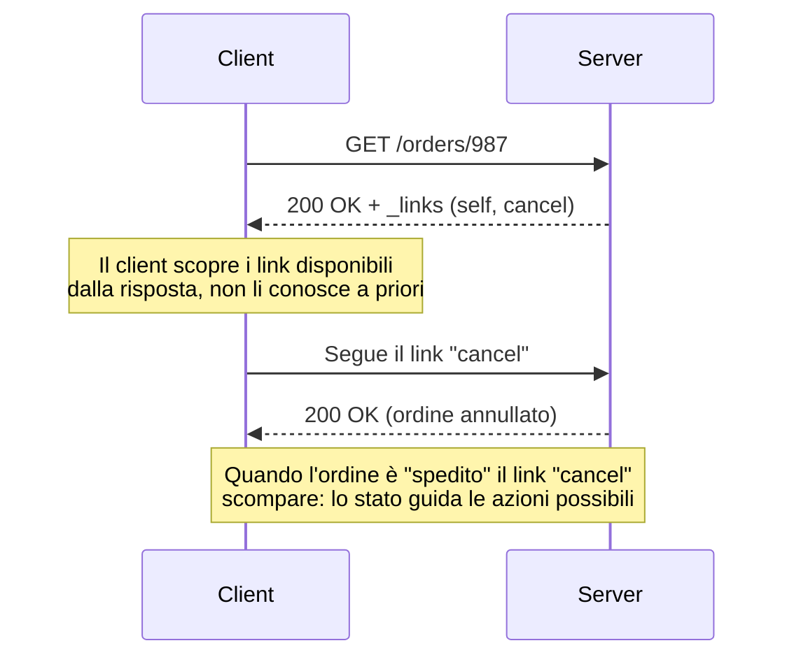
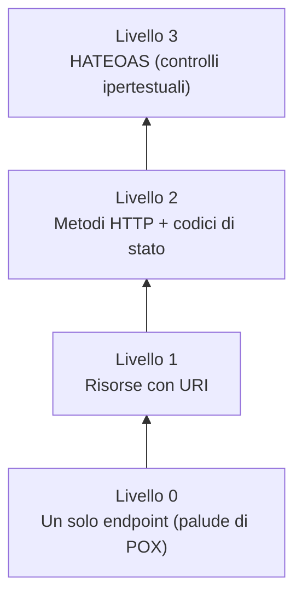

# Documentazione OpenAPI e navigazione HATEOAS

## Prerequisiti
- Conoscere i metodi HTTP e i codici di stato.
- Sapere cosa sono le risorse e gli URI in REST.
- Avere familiarità con i formati JSON e YAML.

## Obiettivi
- Capire a cosa serve la specifica OpenAPI e il suo legame con Swagger.
- Conoscere le sezioni principali di un documento OpenAPI.
- Distinguere gli approcci Design-First e Code-First.
- Comprendere il principio HATEOAS e la struttura di un link ipertestuale.
- Collocare HATEOAS nel modello di maturità di Richardson.

## 1. Documentare e navigare le API
Un'API utile deve essere anche comprensibile e navigabile.
Due strumenti aiutano in questo.

La **documentazione** descrive in modo formale come usare l'API: OpenAPI svolge questo ruolo.
La **navigazione** permette al client di scoprire le azioni disponibili a runtime: HATEOAS svolge questo ruolo.

## 2. La specifica OpenAPI
**OpenAPI** è uno standard per descrivere in modo formale un'API REST.
Il documento è scritto tipicamente in YAML o JSON.

### Relazione con Swagger
OpenAPI è l'evoluzione standardizzata e open-source della specifica **Swagger 2.0**.
La specifica è stata donata alla Linux Foundation e rinominata OpenAPI.
Oggi il nome **Swagger** identifica principalmente la suite di strumenti di SmartBear.
Fanno parte di questa suite Swagger UI, Swagger Editor e Swagger Codegen.
OpenAPI e Swagger non sono quindi standard concorrenti: il secondo è l'origine storica del primo.

### La sezione components e i riferimenti
La sezione **components** raccoglie definizioni riutilizzabili.
Può contenere schemi, parametri, risposte e configurazioni di sicurezza.
Questi elementi si richiamano tramite riferimenti logici, scritti con `$ref`.
L'obiettivo è evitare la duplicazione, centralizzando le definizioni in un solo punto.

### I parametri e l'attributo "in"
Ogni operazione può ricevere parametri.
L'attributo **in** definisce la posizione del parametro.
I quattro valori ammessi sono:

- `query`: nella stringa di query dell'URL.
- `header`: in un'intestazione HTTP.
- `path`: come variabile nel percorso dell'URL.
- `cookie`: in un cookie di sessione.

### Il raggruppamento delle risposte
L'oggetto **responses** descrive le possibili risposte di un endpoint.
È possibile raggruppare una famiglia di codici di stato con una notazione jolly.
Si usa una chiave testuale in lettere maiuscole, per esempio `4XX`.
In questo modo si descrivono con una sola voce tutti gli errori del client.
Sono valide anche le forme `2XX` e `5XX`.

### La sicurezza in due passaggi
Proteggere un endpoint in OpenAPI richiede due passaggi.
Prima si definisce il meccanismo nell'oggetto `securitySchemes`, dentro `components`.
Per esempio, si dichiara uno schema HTTP di tipo Bearer.
Poi si applica la protezione con la proprietà `security`, a livello globale o di singola operazione.
Senza entrambi i passaggi, la protezione non è completa.

### Design-First e Code-First
Esistono due approcci per produrre la specifica.

Nell'approccio **Design-First** si scrive prima la specifica OpenAPI, a mano o con un editor.
La specifica diventa il contratto iniziale tra i team, prima di scrivere il codice.

Nell'approccio **Code-First** la specifica viene generata dalle annotazioni inserite nel codice già scritto.
È quindi l'opposto del Design-First.

### Esempio di documento OpenAPI
```yaml
openapi: 3.0.3
info:
  title: API Utenti
  version: 1.0.0
paths:
  /users/{id}:
    get:
      parameters:
        - name: id
          in: path
          required: true
          schema:
            type: integer
      responses:
        "200":
          description: Utente trovato
          content:
            application/json:
              schema:
                $ref: "#/components/schemas/Utente"
        "4XX":
          description: Errore del client
      security:
        - bearerAuth: []
components:
  securitySchemes:
    bearerAuth:
      type: http
      scheme: bearer
  schemas:
    Utente:
      type: object
      properties:
        id:
          type: integer
        nome:
          type: string
```

## 3. Il principio HATEOAS
**HATEOAS** significa *Hypermedia As The Engine Of Application State*.
È uno dei vincoli dell'interfaccia uniforme di REST.

### Cosa è l'ipermedia
*Hypermedia* significa media più collegamenti (link).
È un'estensione dell'idea di ipertesto, che è testo più link, come accade in HTML.
Con HATEOAS il server guida lo stato dell'applicazione inviando link nelle risposte.

### La struttura di un link
Un link ipertestuale è composto tipicamente da due parti.

- `href`: l'indirizzo (URL) della risorsa collegata.
- `rel` (relation): la relazione semantica del collegamento.

L'attributo **rel** indica *cosa* rappresenta quel link.
Per esempio, `rel="next"` o `rel="cancel"`.
Il client usa il valore di `rel` per decidere come mostrare o utilizzare il collegamento.

### Il vantaggio del disaccoppiamento
HATEOAS disaccoppia il client dall'architettura degli URL del server.
Il client scopre le azioni disponibili tramite i link forniti nella risposta.
Il server può quindi modificare i propri endpoint senza rompere l'applicazione client.

Il client deve conoscere solo l'endpoint iniziale, detto *entry point*.
Tutte le altre risorse e azioni si scoprono dinamicamente dai link restituiti.
Il client non deve memorizzare nel proprio codice (hardcoding) tutti gli URI di navigazione.

### Lo stato guida i link disponibili
HATEOAS riflette in modo dinamico lo stato della risorsa e le regole di business.
Il server include o omette i link in base allo stato della risorsa e ai permessi dell'utente.
Per esempio, se un ordine è già spedito, il server non includerà il link `rel="cancel"`.
Così il client non mostra né tenta azioni non permesse.



### Il modello di maturità di Richardson
Il **Richardson Maturity Model** misura quanto un'API è vicina al pieno stile REST.
Ha quattro livelli:

- Livello 0: un'unica risorsa generica (la cosiddetta "palude di POX").
- Livello 1: introduzione delle risorse identificate da URI.
- Livello 2: uso corretto dei metodi HTTP.
- Livello 3: introduzione dei controlli ipertestuali, cioè HATEOAS.

HATEOAS rappresenta quindi il livello massimo, il Livello 3.



### Formati standard: HAL
Esistono formati standard per strutturare i link in modo uniforme.
**HAL** (*Hypertext Application Language*) è uno dei più diffusi.
Si basa su JSON o XML.
JSON-HAL definisce convenzioni come gli oggetti `_links` e `_embedded`.

### Svantaggi di HATEOAS
HATEOAS comporta anche alcune criticità.

- Aumenta la complessità di sviluppo del client, che deve analizzare l'albero dei link.
- Incrementa la dimensione del payload, per via dei metadati dei collegamenti.

HATEOAS non protegge da ogni tipo di cambiamento.
Non rende il client immune alle modifiche dei tipi di dato nel payload principale.
Per esempio, cambiare una proprietà da stringa a intero può comunque rompere il client.

### Esempio di risposta HATEOAS
```http
GET /orders/987 HTTP/1.1
Host: api.example.com
Accept: application/json
```

```http
HTTP/1.1 200 OK
Content-Type: application/json

{
  "id": 987,
  "stato": "in_lavorazione",
  "totale": 42.50,
  "_links": {
    "self": { "href": "/orders/987" },
    "cancel": { "href": "/orders/987/cancellation", "rel": "cancel" }
  }
}
```

Quando l'ordine passa allo stato "spedito", il link `cancel` scompare dalla risposta.

## 4. Errori comuni
- Errore: pensare che OpenAPI e Swagger siano standard rivali e incompatibili.
  Correzione: OpenAPI è l'evoluzione standardizzata di Swagger; Swagger oggi indica gli strumenti.
- Errore: ripetere lo stesso schema dati in più punti del documento OpenAPI.
  Correzione: definirlo una volta in `components` e richiamarlo con `$ref`.
- Errore: dichiarare uno `securityScheme` senza applicarlo con `security` (o viceversa).
  Correzione: servono entrambi i passaggi per proteggere davvero l'endpoint.
- Errore: costringere il client a salvare in hardcoding tutti gli URI dell'API.
  Correzione: con HATEOAS il client parte dall'entry point e segue i link.
- Errore: confondere i livelli del Richardson Maturity Model collocando HATEOAS sotto i metodi HTTP.
  Correzione: HATEOAS è il Livello 3, il più alto, sopra l'uso dei metodi HTTP (Livello 2).

## Riepilogo
- OpenAPI è lo standard per documentare le API REST ed è l'evoluzione di Swagger 2.0.
- In OpenAPI `components` e `$ref` evitano la duplicazione, i parametri usano `in` (query, header, path, cookie) e le risposte si raggruppano con notazioni come `4XX`.
- La protezione in OpenAPI richiede due passaggi: definire lo schema in `securitySchemes` e applicarlo con `security`.
- HATEOAS, cioè Hypermedia As The Engine Of Application State, fa sì che il server guidi il client tramite link con `href` e `rel`.
- HATEOAS disaccoppia il client dagli URL ed è il Livello 3 del Richardson Maturity Model, ma aumenta complessità e dimensione del payload.
